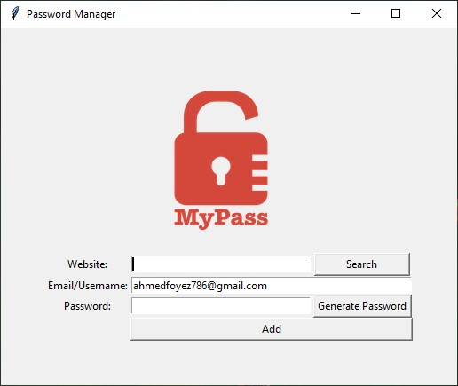

# Password Manager App

This is a simple password manager application built using Python and Tkinter. It allows users to store their passwords securely, generate strong passwords, and search for passwords associated with specific websites.

## Features

- **Password Generator**: Generate strong passwords with a mix of letters, numbers, and symbols.
- **Copy to Clipboard**: Generated passwords can be copied to the clipboard for easy usage.
- **Save Passwords**: Store website, email, and password information securely in a JSON file.
- **Find Passwords**: Search for a specific website's password and retrieve associated details.
- **User-friendly Interface**: Clean and straightforward UI for easy interaction.

